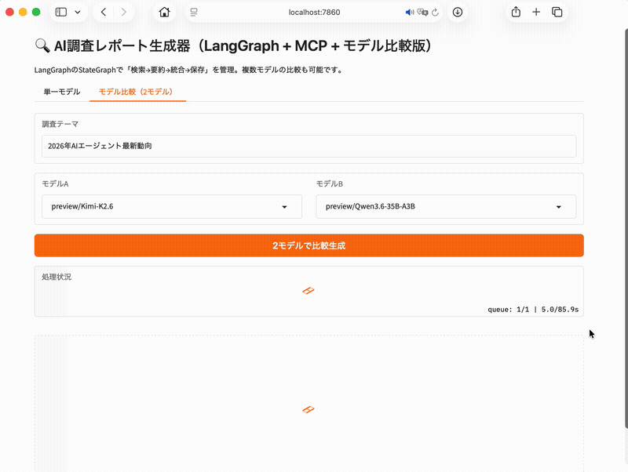
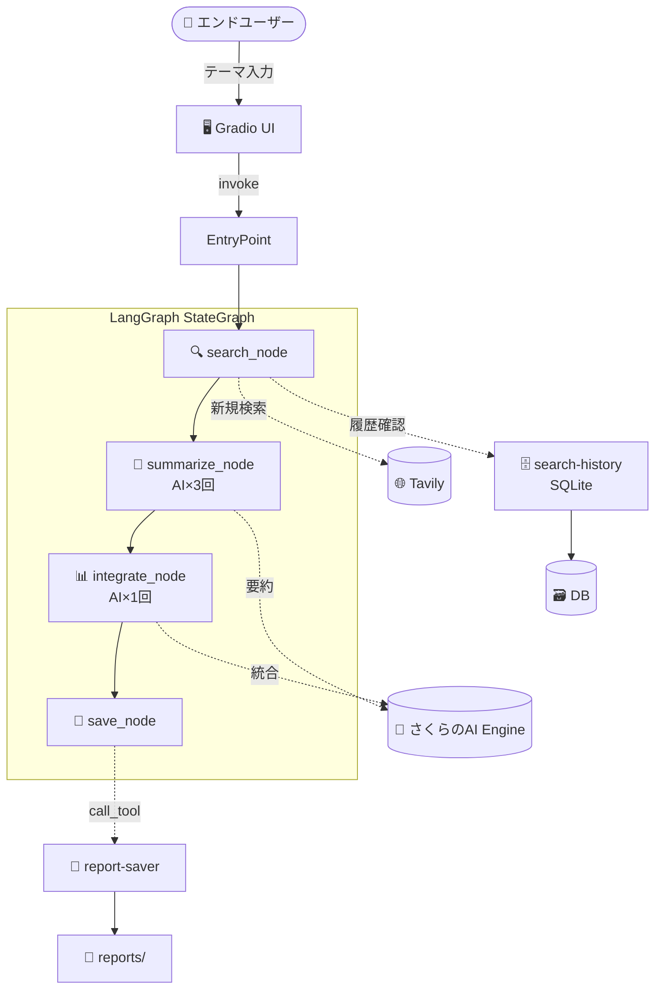

# 🌸 Sakura AI Agent — AI調査レポート自動生成システム

[](https://www.python.org/)
[](https://www.gradio.app/)
[](https://langchain-ai.github.io/langgraph/)
[](https://www.sakura.ad.jp/ai-engine/)

> **「テーマを入力するだけで、数分後にMarkdownレポートが完成する」**
>
> さくらのAI Engine（無料枠 3,000リクエスト/月）で動作する、LangGraphベースのAI調査レポート自動生成エージェントです。

---

## 📑 目次

- [デモ](#-デモ)
- [できること](#-できること)
- [システム構成](#-システム構成)
- [クイックスタート](#-クイックスタート)
- [環境変数](#-環境変数)
- [使い方](#-使い方)
- [対応モデル一覧](#-対応モデル一覧)
- [MCPサーバー](#-mcpサーバー)
- [トラブルシューティング](#-トラブルシューティング)
- [リクエスト消費の目安](#-リクエスト消費の目安)
- [今後の展望](#-今後の展望)
- [ライセンス](#-ライセンス)

---

## 🎬 デモ

<!-- TODO: デモGIFを `assets/demo.gif` に配置して差し替え -->


**入力:** `2026年のAIエージェント最新動向`  
**出力:** `reports/2026年のAIエージェント最新動向.md`

---

## ✨ できること

| 機能 | 説明 |
|------|------|
| 🔍 **自動検索** | Tavily APIで最新情報を検索（履歴があればキャッシュ再利用） |
| 📝 **AI要約** | 各検索結果をAIが300字以内で要約（並列3回） |
| 📊 **統合レポート** | 要約を統合し、Markdown形式の構造化レポートを生成 |
| 💾 **自動保存** | 自作MCPサーバー経由で `reports/` ディレクトリに保存 |
| 🔄 **モデル比較** | 7つのモデルを切り替えて同じテーマで出力を比較 |
| 🗄️ **履歴管理** | SQLiteで検索履歴を管理し、2回目以降はTavily消費ゼロ |

---

## 🏗️ システム構成



### ノード構成

| ノード | 役割 | AI呼び出し |
|--------|------|-----------|
| `search` | Tavily検索 or 履歴再利用 | 0回 |
| `summarize` | 各サイトを300字以内で要約 | **3回**（並列） |
| `integrate` | 要約を統合してレポート生成 | **1回** |
| `save` | MCPサーバー経由でファイル保存 | 0回 |

**1回のレポート生成 = 合計4回のAI呼び出し**

---

## 🚀 クイックスタート

### 必要条件

- Python 3.10+
- さくらのAI Engine APIキー（[無料枠 3,000リクエスト/月](https://www.sakura.ad.jp/ai-engine/)）
- Tavily APIキー（[無料枠 1,000回/月](https://tavily.com/)）

### インストール

```bash
git clone https://github.com/kenichikawaguchi/sakura-ai-agent.git
cd sakura-ai-agent
python -m venv venv
source venv/bin/activate  # Windows: venv\Scripts\activate
pip install -r requirements.txt
```

### 環境変数設定

```bash
cp .env.example .env
# .envを編集してAPIキーを設定
```

### 起動

```bash
# Gradio UI起動
python main.py

# ブラウザで http://localhost:7860 を開く
```

---

## 🔐 環境変数

`.env` ファイルに以下を設定してください。

```env
# 必須
SAKURA_AI_API_KEY=sk-xxxxxxxxxxxxxxxxxxxxxxxxxxxxxxxx
TAVILY_API_KEY=tvly-xxxxxxxxxxxxxxxxxxxxxxxxxxxxxxxx

# 任意（デフォルト値あり）
SAKURA_AI_BASE_URL=https://api.sakura.ai/engine/v1
GRADIO_SERVER_NAME=0.0.0.0
GRADIO_SERVER_PORT=7860
```

| 変数名 | 必須 | 説明 |
|--------|------|------|
| `SAKURA_AI_API_KEY` | ✅ | さくらのAI Engine APIキー |
| `TAVILY_API_KEY` | ✅ | Tavily Search APIキー |
| `SAKURA_AI_BASE_URL` | ❌ | さくらのAI Engine ベースURL |
| `GRADIO_SERVER_NAME` | ❌ | Gradioサーバーのホスト名 |
| `GRADIO_SERVER_PORT` | ❌ | Gradioサーバーのポート番号 |

---

## 🖥️ 使い方

### 1. Web UIから使う

```bash
python main.py
```

1. ブラウザで `http://localhost:7860` を開く
2. **テーマ** を入力（例: `2026年のAIエージェント最新動向`）
3. **モデル** を選択
4. **「レポート生成」** ボタンをクリック
5. 数分後、`reports/` ディレクトリにMarkdownファイルが保存される

### 2. プログラムから使う

```python
from main import generate_report

report = generate_report(
    theme="2026年のAIエージェント最新動向",
    model="preview/Qwen3.6-35B-A3B"
)
print(report)
```

### 3. 保存済みレポートの確認

```bash
# MCPツール経由で一覧取得
python -m mcp_servers.report_saver
```

---

## 🤖 対応モデル一覧

```python
AVAILABLE_MODELS = [
    "gpt-oss-120b",
    "llm-jp-3.1-8x13b-instruct4",
    "preview/Kimi-K2.6",
    "preview/Qwen3.6-35B-A3B",
    "preview/gemma-4-31B-it",
    "preview/Kimi-K2.7-Code",
    "preview/Qwen3-VL-30B-A3B-Instruct",
]
```

### モデル選定の指針

| 用途 | おすすめモデル | 理由 |
|------|-------------|------|
| サクッと要約したい | `preview/Kimi-K2.6` | 簡潔・自然な日本語 |
| 深く分析・構造化したい | `preview/Qwen3.6-35B-A3B` | 絵文字マーカー・階層化・詳細出力 |
| 日本語の正確性重視 | `llm-jp-3.1-8x13b-instruct4` | 日本語ドキュメントに強い |
| 複雑な推論・長文生成 | `gpt-oss-120b` | max_tokens制限が緩い |

### モデル別の注意点

| モデル | 注意点 |
|--------|--------|
| `gpt-oss-120b` | thinkingブロックにより `content` が `None` になることがあります。`reasoning_content` → `model_extra` の順にフォールバックしています。 |
| `llm-jp-3.1-8x13b-instruct4` | max_tokens上限が **4096トークン** と厳しいです。統合レポートは1500トークンに制限しています。 |
| `preview/Kimi-K2.6` | 応答は `content` フィールドに含まれます。簡潔な出力が特徴です。 |
| `preview/Qwen3.6-35B-A3B` | 応答が `model_extra['reasoning']` に含まれることがあります。詳細な構造化出力が特徴です。 |

---

## 🔌 MCPサーバー

本プロジェクトでは、2つの自作MCPサーバーを実装しています。

### 1. `report-saver` — レポート保存サーバー

```python
@mcp.tool()
def save_report(filename: str, content: str) -> str:
    """レポートを reports/ ディレクトリに保存"""

@mcp.tool()
def list_reports() -> str:
    """保存済みレポートの一覧を取得"""
```

### 2. `search-history` — 検索履歴管理サーバー

```python
@mcp.tool()
def save_search_history(theme: str, results_json: str) -> str:
    """検索結果をSQLiteに保存"""

@mcp.tool()
def get_search_history(theme: str) -> str:
    """テーマに一致する最新の検索履歴を取得"""
```

> **ポイント:** MCP 2.0.0 では `FastMCP` が使えなくなり、`MCPServer` クラスに変更されています。本プロジェクトでは公式GitHubのREADMEを確認して実装しています。

---

## 🛠️ トラブルシューティング

### `content` が `None` で `.strip()` が失敗する

**原因:** gpt-oss-120b などのモデルで thinkingブロックが出力されるため。  
**解決:** `get_content_from_response()` 関数で `reasoning_content` → `model_extra['reasoning']` の順にフォールバックしています。

### `max_tokens is too large` エラー

**原因:** llm-jp-3.1-8x13b-instruct4 の最大コンテキスト長が4096トークンのため。  
**解決:** モデルごとに `MODEL_LIMITS` を定義し、統合レポートのmax_tokensを自動調整しています。

| モデル | summarize | integrate |
|--------|-----------|-----------|
| `gpt-oss-120b` | 400 | 3000 |
| `llm-jp-3.1-8x13b-instruct4` | 400 | **1500** |
| `preview/Kimi-K2.6` | 800 | 3000 |
| `preview/Qwen3.6-35B-A3B` | 800 | 3000 |

### `ModuleNotFoundError: No module named 'mcp.server.fastmcp'`

**原因:** MCP 2.0.0 で `FastMCP` が削除されたため。  
**解決:** `from mcp.server import MCPServer` を使用してください。

---

## 📊 リクエスト消費の目安

さくらのAI Engineの無料枠は **3,000リクエスト/月** です。

| フェーズ | 消費リクエスト | 累計 |
|---------|-------------|------|
| Gradio Quickstart | 2 | 2 |
| Tavily連携テスト | 4 | 6 |
| MCPサーバー構築 | 4 | 10 |
| LangGraph化 | 4 | 14 |
| モデル比較（2モデル×2回） | 16 | 30 |
| **1回のレポート生成** | **4** | — |

### コスト最適化のヒント

- **履歴再利用:** 同じテーマの2回目以降はTavily APIを呼ばず、SQLiteキャッシュから取得
- **モデル比較の頻度:** 毎日3回実行すると、約2週間で無料枠到達
- **Tavilyとの比率:** Tavily 1,000回/月 と さくらAI 3,000回/月 の比率は約 **1:3** が最適

---

## 🔮 今後の展望

- [ ] 従量課金に移行して「毎日自動ニュース収集」を運用
- [ ] Slack Bot化、メール定期配信化
- [ ] MCPサーバーを追加（翻訳・要約スタイル変更・画像生成など）
- [ ] 複数モデルの出力をアンサンブルして品質向上
- [ ] Docker対応・Cloud Runデプロイ

---

## 📄 ライセンス

MIT License

---

## 🙏 謝辞

- [さくらのAI Engine](https://www.sakura.ad.jp/ai-engine/) — 無料枠での実験を可能にしてくれたプラットフォーム
- [nomurasanさんの入門記事](https://qiita.com/nomurasan/items/63654a3f9457a8b5ed35) — さくらのAI Engineの使い方を学ぶきっかけ
- [Tavily](https://tavily.com/) — 高品質な検索API
- [LangGraph](https://langchain-ai.github.io/langgraph/) — エージェントワークフローの実装

---

> **「Hello World」の次は「実用的なアプリ」。さくらのAI Engineの無料枠、使い倒しましょう！**

